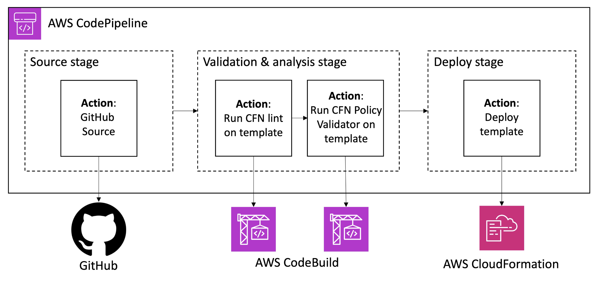

# Integrating AWS IAM Access Analyzer in a CI/CD Pipeline

## Overview

This project demonstrates how AWS IAM Access Analyzer can be integrated
into a CI/CD pipeline to automatically validate IAM policies before
infrastructure is deployed.

The pipeline uses GitHub as the source repository, AWS CodePipeline for
continuous delivery, AWS CodeBuild for validation and analysis, and AWS
CloudFormation for infrastructure deployment.

## Architecture

The CI/CD pipeline consists of three major stages:

1. **Source** — GitHub stores the CloudFormation template and supporting configuration.
2. **Validation & Analysis** — AWS CodeBuild runs CloudFormation linting and IAM policy validation using AWS IAM Access Analyzer.
3. **Deployment** — AWS CloudFormation deploys the template after the validation checks pass.

## Objectives

- Validate IAM policies automatically during CI/CD.
- Detect invalid IAM actions and policy issues before deployment.
- Use AWS IAM Access Analyzer as a security control in the pipeline.
- Demonstrate how a failed security check can prevent deployment.
- Deploy infrastructure using AWS CloudFormation.

## AWS Services

- AWS IAM Access Analyzer
- AWS CodePipeline
- AWS CodeBuild
- AWS CloudFormation
- GitHub

## Project Status

🚧 In progress
